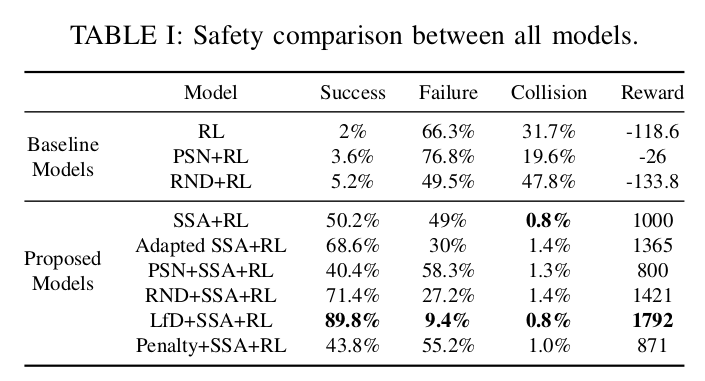
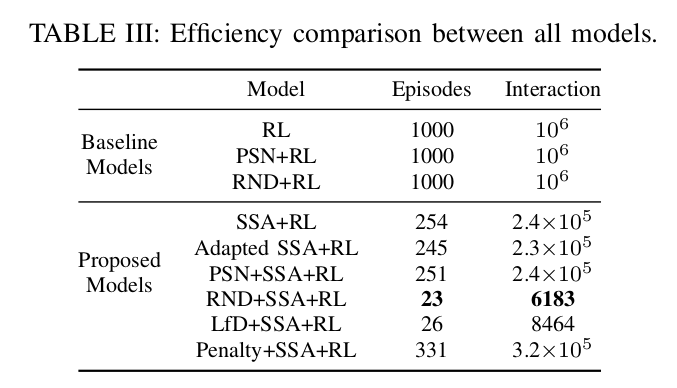
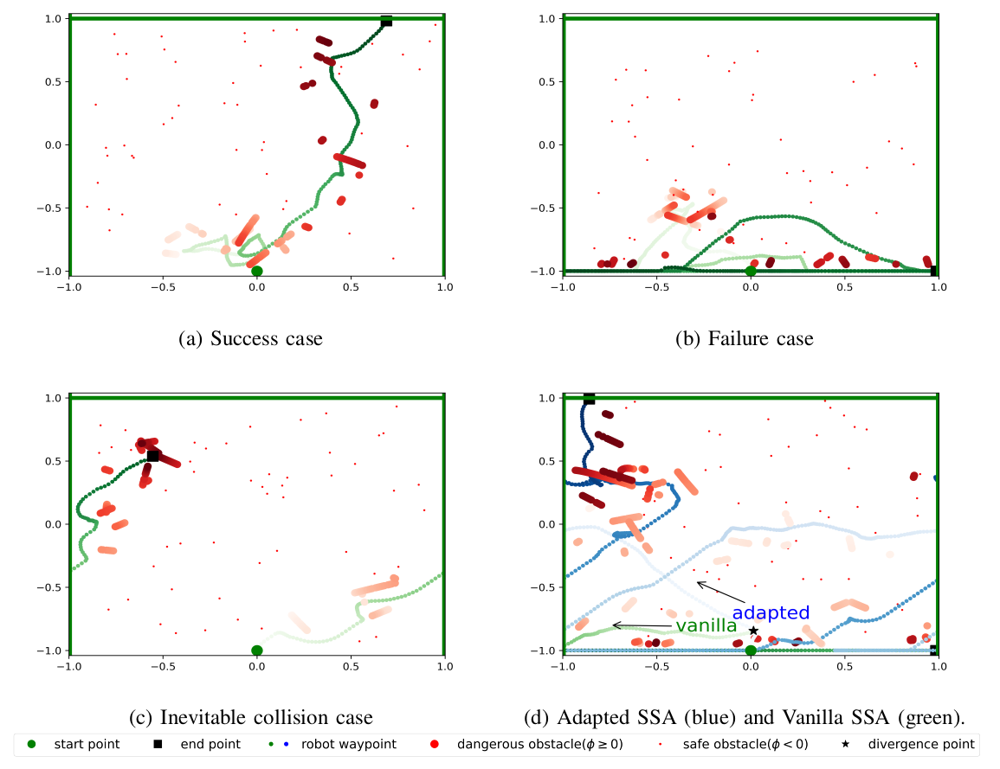

# Safe-and-Sample-efficient-Reinforcement-Learning-for-Clustered-Dynamic-Uncertain-Environments


[](LICENSE)
[](https://github.com/RichardLitt/standard-readme)

This is an example file with maximal choices selected.

This is a long description.

## Table of Contents
- [Introduction](#Introduction)
- [Install](#install)
- [Usage](#usage)
- [API](#api)
- [Contributing](#contributing)
- [License](#license)


## Introduction
We provide code for evaluate the safety and sample-efficiency of our proposed RL framework.

For safety, we use Safe Set Algorithm (SSA). 
For efficiency, there are more strategies you can choose:
1, Adapting SSA
2, Exploration (PSN, RND, None)
3, Learning from SSA

The safety and efficiency results of all models are shown below



We also provide visual tools.



## Install

```
conda create -n safe-rl
conda install python=3.7.9
pip install tensorflow
pip install keras
pip install matplotlib
pip install gym
pip install cvxopt
```

## Usage

```
python test_one.py --display {none, turtle} --explore {none, psn, rnd} --no-qp --no-ssa-buffer
python test_one.py --display {none, turtle} --explore {none, psn, rnd} --qp --no-ssa-buffer
python test_one.py --display {none, turtle} --explore {none, psn, rnd} --no-qp --ssa-buffer
```


